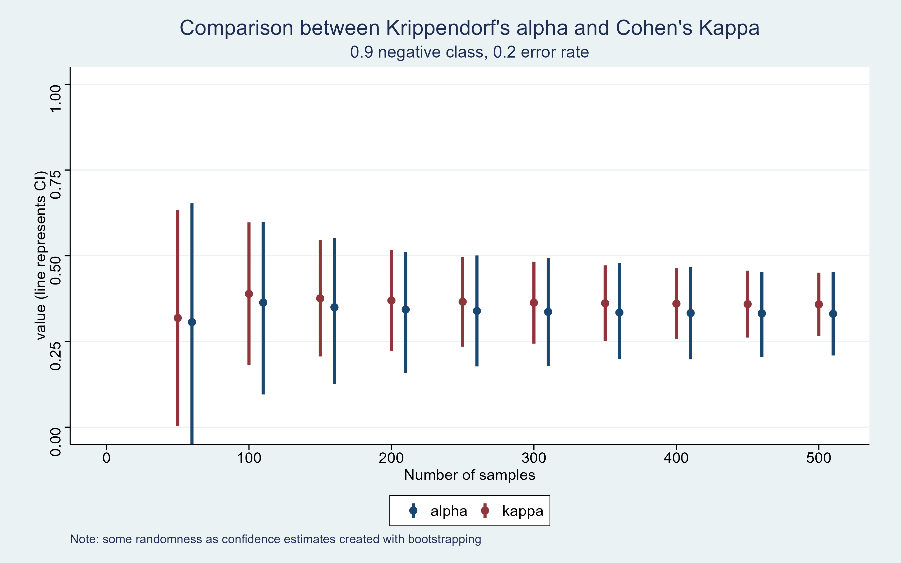
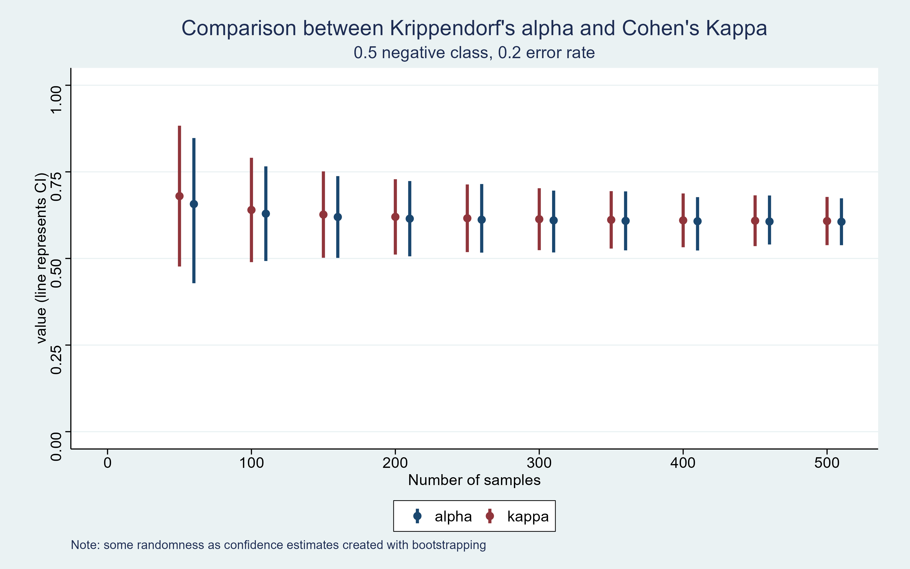
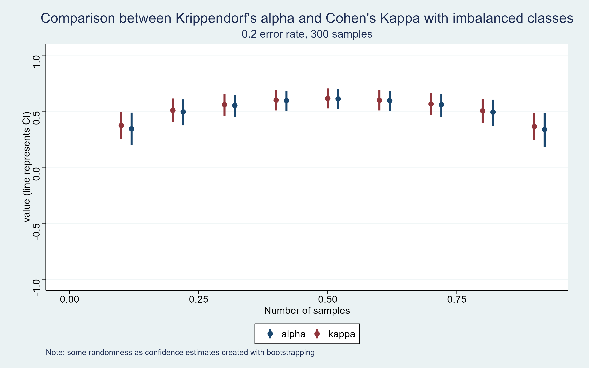

# Inter-rater reliability confidence interval simulations

I am going to be calculating inter-rater reliability with imbalanced data (approximately 90% negative class, 10% positive class). This means asking an individual to manually code a number of sentences that have already been coded. I will then measure the agreement rate using:

1. Cohen's Kappa
2. Krippendorf's alpha

The purpose of this repo is to simulate data to establish the optimal number of sentences to test. This means trying to minimise the number of sentences that need to be manually classified twice, while still achieving an acceptable confidence interval.

## Parameters for simulation

The parameters that I will test at different levels:

1. Number of samples, i.e. number of sentences to be manually classified by both raters.
2. Imbalance. Although the raw dataset is imbalanced, it may be desirable to select a more balanced subset of the data, as more samples in the positive class should reduce the uncertainty of the estimate.
3. Error rate. It is unknown what proportion of sentences the raters will disagree on. Once a sample size and imbalance is decided upon, we will want to make sure that the uncertainty is not sensitive to the error rate.

## Results

### Imbalanced data

Although confidence increases with larger samples, Krippendorf’s alpha has wider confidence intervals than Cohen’s Kappa with imbalanced data.

### Balanced data

This discrepancy disappears with balanced data.

It is also notable that with balanced data, the confidence intervals are smaller than at the extremes, particularly for Krippendorf's alpha. Further simulations confirm this:

## Comparison of Krippendorf's alpha confidence intervals using different packages

I originally calculated the confidence intervals for Krippendorf's alpha using [kripp.boot](https://github.com/MikeGruz/kripp.boot). However the size of the confidence intervals did not appear to decline as the sample size increased. I found this surprising although I am not sure if it is expected behaviour so raised this as a [github issue](https://github.com/MikeGruz/kripp.boot/issues/1).

This script calculates alpha using `kripp.boot` and the [`krippendorffsalpha`](https://github.com/drjphughesjr/krippendorffsalpha) package. In the second case the confidence interval declines as the sample size increases. I discuss this more [here]("./blob/main/kripp_alpha_vs_kripp_boot.md")