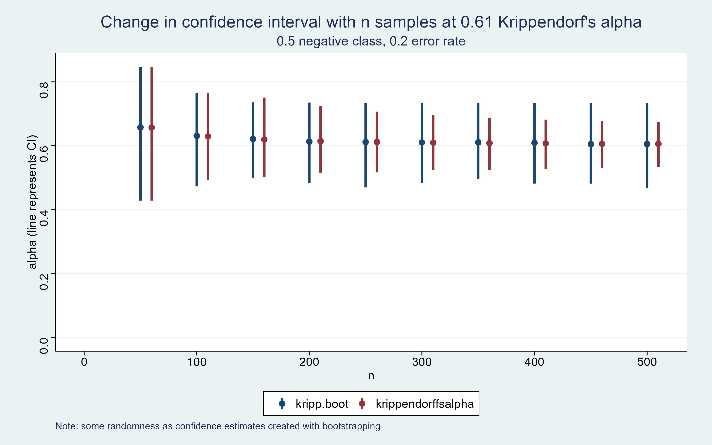
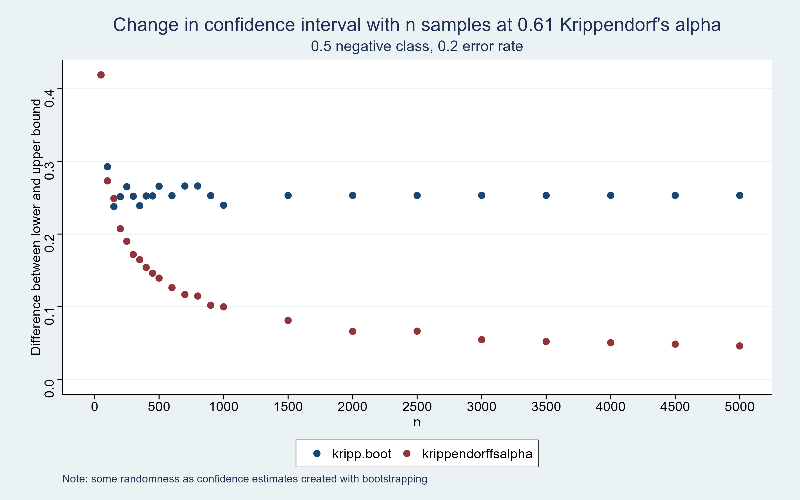
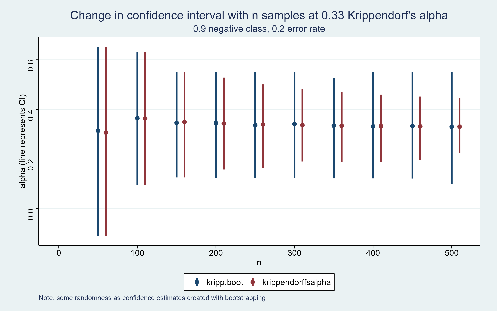
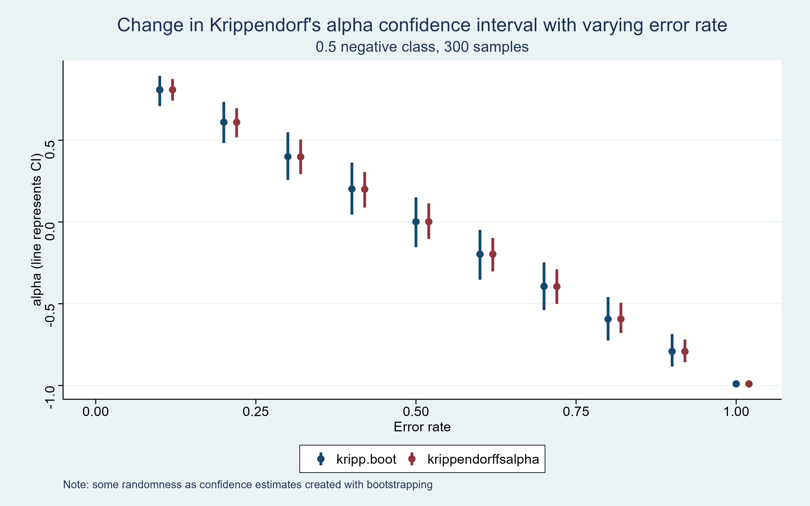
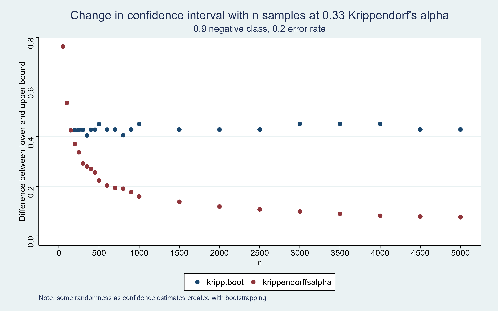

# Calculating confidence intervals for Krippendorf's alpha

I originally calculated the confidence intervals for Krippendorf's alpha using [`kripp.boot`](https://github.com/MikeGruz/kripp.boot). However the size of the confidence intervals did not appear to decline as the sample size increased. I found this surprising although I am not sure if it is expected behaviour so raised this as a [github issue](https://github.com/MikeGruz/kripp.boot/issues/1).

## Comparison of Krippendorf's alpha confidence intervals using different packages

Scripts 1-3 of this repo run some simulations to calculate Krippendorf's alpha with a 95% confidence interval using [`kripp.boot`](https://github.com/MikeGruz/kripp.boot) and the [`krippendorffsalpha`](https://github.com/drjphughesjr/krippendorffsalpha) package. In the second case the confidence interval declines as the sample size increases.

## Comparison of balanced samples

I ran some simulations with a varying sample size but keeping the classes balanced (50% in each class). The error rate was 0.2.

I have used the phrase "error rate" to refer to the proportion of true positives and true negatives that are misclassified. For example, with a balanced dataset of 100 perfectly classified samples, the confusion matrix would be:

|  | **_Rater 2_** |  |  |  |
|---|---|---|---|---|
| **_Rater 1_** | Class | 0 | 1 |  |
|  | 0 | 50 | 0 |  |
|  | 1 | 0 | 50 |  |

If we set the error rate at 0.2, the confusion matrix would be:

|  | **_Rater 2_** |  |  |  |
|---|---|---|---|---|
| **_Rater 1_** | Class | 0 | 1 |  |
|  | 0 | 40 | 10 |  |
|  | 1 | 10 | 40 |  |

This would lead to Krippendorf's alpha and Cohen's Kappa of about 0.6.

Conversely in an imbalanced dataset with perfect agreement between raters, we would have this confusion matrix:

|  | **_Rater 2_** |  |  |  |
|---|---|---|---|---|
| **_Rater 1_** | Class | 0 | 1 |  |
|  | 0 | 80 | 0 |  |
|  | 1 | 0 | 20 |  |

Applying a 0.2 error rate would lead to:

|  | **_Rater 2_** |  |  |  |
|---|---|---|---|---|
| **_Rater 1_** | Class | 0 | 1 |  |
|  | 0 | 64 | 16 |  |
|  | 1 | 4 | 16 |  |

Note that for simplicity I have assumed that the error rate is applied in equal proportions to the negative and positive samples.

### Estimate of alpha

The estimate of `alpha` is the same with both packages. However, the confidence intervals are not:

### Estimate of confidence interval

The size of the confidence interval decreases as the sample size decreases using the `krippendorffsalpha` package but not the `kripp.boot` package:

## Comparison of imbalanced samples

This holds true across imbalanced samples as well (although note that with imbalanced data, the value of Krippendorf's alpha is lower than with balanced data, and the confidence interval is greater):

### Estimate of alpha

The estimates of alpha remain the same with each package. However, the 95% confidence intervals differ.

### Estimate of confidence interval

Once again we see that with `kripp.boot` the confidence interval does not decrease as the number of samples increases.

## Comparison across error rates

In this case, the number of samples was held constant at 300 and the classes were balanced. 

### Estimates of alpha

Once again the estimates of `alpha` is the same with both packages. In this case the confidence intervals of both packages change - although there is an absolute difference between them.

### Estimates of confidence interval

We see more clearly in the scatter plot that both estimates of the confidence interval of the estimate of alpha are a function of the error rate and follow the same distribution. However the `kripp.boot` confidence interval is always significantly larger.

The same holds true with imbalanced data:

Apart from when comparing the packages, the estimates in this repo use the `krippendorfsalpha` package rather than `kripp.boot`.